# replot-map: Map charts for react
Intelligent and customizable map chart components for react.

## Installation
Only works with React projects. React must be installed separately.
```bash
npm install replot-map
```

Then with a module bundler like webpack/browserify that supports CommonJS/ES2015
modules, use as you would anything else.

```javascript
import {Map} from 'replot-map'
```

## API
replot-map is designed to create beautiful map charts right out of the box.
The only *required* inputs are properly formatted data and svg paths of your map.

### Basic Usage
In the simplest case, just supply data and svg paths (as Javascript arrays) and specify the
keys for geocodes and weights of data and IDs and titles of paths:

``` javascript
render() {
    let populations = [
        {"code": "US-AL", "population": 4853875},
        {"code": "US-AK", "population": 737709},
        {"code": "US-AZ", "population": 6817565},
        ...
    ]

    let paths = [
    	  {"ID":"US-AK", "name":"Alaska", "d":"M456.18,...,731.03z"},
        {"ID":"US-AL", "name":"Alabama", "d":"M955.38,...,481.61z"},
        {"ID":"US-AZ", "name":"Arizona", "d":"M533.89,...,320.29z"},
        ...
    ]

    return(
        <Map data={populations}
            geoCode="code"
            weightKey="population"
            paths={paths}
            pathIDKey="ID"
            pathTitleKey="name"
        />
    )
}
```

- `data` and `paths` are the only required props
- `geoCode` defaults to `"ID"`
- `weightKey` defaults to `"weight"`
- `pathIDKey` defaults to `"id"`
- `pathTitleKey` defaults to `"title"`

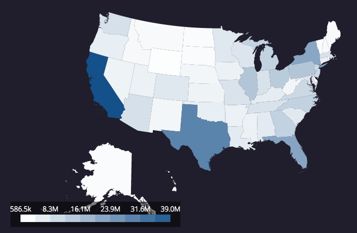

You can also import our complimentary svg map paths:

``` javascript
import {Map, USA} from 'replot-map'
```
``` javascript
render() {
    let populations = [
        {"code": "US-AL", "population": 4853875},
        {"code": "US-AK", "population": 737709},
        {"code": "US-AZ", "population": 6817565},
        ...
    ]

    return(
        <Map data={populations}
            geoCode="code"
            weightKey="population"
            paths={USA}
        />
    )
}
```

If you're using our complimentary map paths, do not specify `pathIDKey` or `pathTitleKey`.

Our complimentary map paths currently support 243 countries and regions. See [the list of all supported countries/regions](#supported-countries-and-regions).

### Dimensions
Dimensions may be specified by passing in `width` prop with a number, in the unit of pixels.

```javascript
render() {
  return(
    <Map data={populations} paths={USA} width={600} />
  )
}
```

- `width` defaults to `800`

Width dimensions may also be specified with a string, as a percentage. The width
will then be calculated as a proportion of the parent container.

```javascript
render() {
  return(
    <Map data={populations} paths={USA} width="60%" />
  )
}
```

 Default (800px)            | width={600}               | width="60%"              
:-------------------------:|:-------------------------:|:-------------------------:
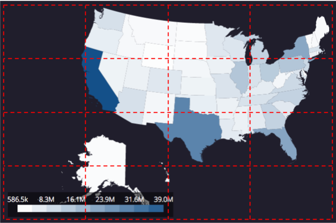 | 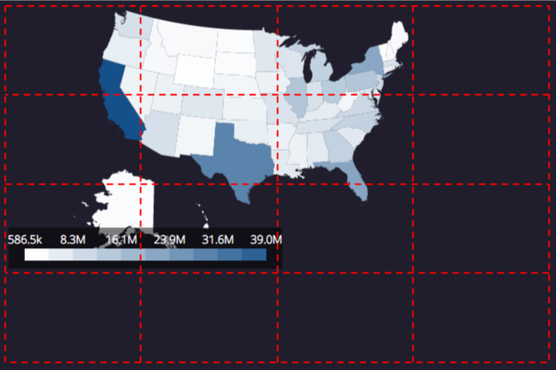 | 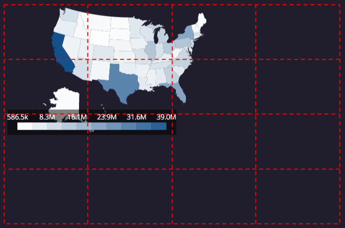

Height dimension will be adjusted automatically to best match the width, fitting the entirity of map without skewing the original aspect ratio.

### Zoom
You may zoom into a specific area of map by passing in `zoomID` and `zoomScale` props. The Map will be centered on the area specified by `zoomID`, scaled up by `zoomScale`. Original dimensions of the Map will be preserved.

```javascript
render() {
  return(
    <Map data={populations} paths={USA} zoomID="US-TX" zoomScale={2} />
  )
}
```

- `zoomID` defaults to `null`
- `zoomScale` defaults to `1`

If `zoomScale` is passed in, but `zoomID` is not, the Map will be scaled up from its top left corner by `zoomScale`.

 Default                   |zoomID={null} zoomScale={2}|zoomID="US-TX" zoomScale={2}         
:-------------------------:|:-------------------------:|:-------------------------:
 | 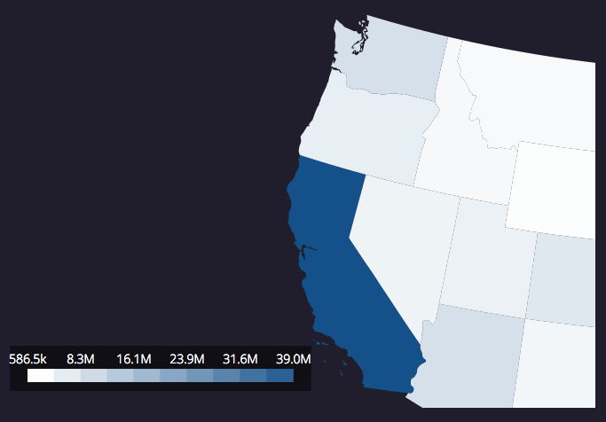 | 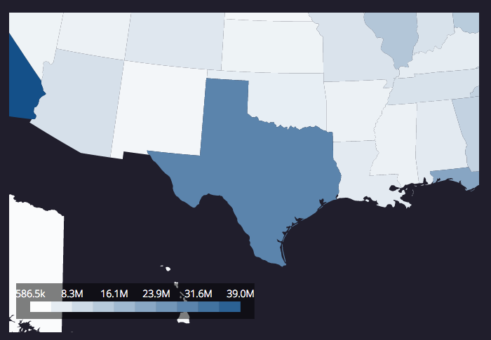

### Color
Colors may be specified by passing in `colorRangeLow` and `colorRangeHigh` props. The Map is colored with the gradient in the range of `colorRangeLow` to `colorRangeHigh`, from the smallest to the largest weight.

```javascript
render() {
  return(
    <Map data={populations} paths={USA} colorRangeLow="#ffffff" colorRangeHigh="#ff4c4c" />
  )
}
```

- `colorRangeLow` defaults to `"#ffffff"`
- `colorRangeHigh` defaults to `"#225588"`

 Default                   |colorRangeLow="#ffffff" colorRangeHigh="#ff4c4c"         
:-------------------------:|:-------------------------:
 | 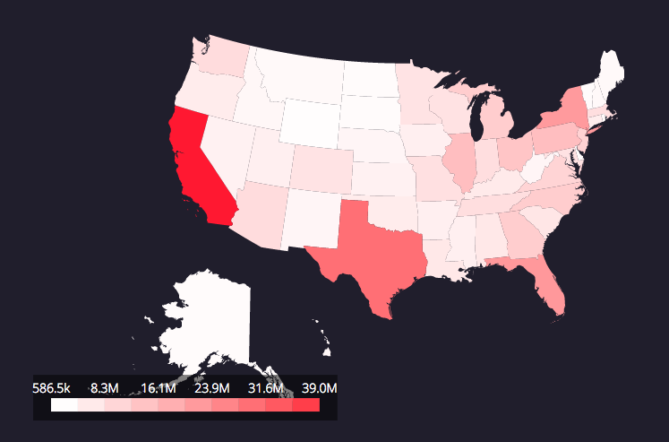

#### Coloring Regions with No Data
Color of the regions with no data may be specified by passing in `noDataColor` prop.

```javascript
render() {
  return(
    <Map data={populations} paths={USA} noDataColor="red" />
  )
}
```

- `noDataColor` defaults to the value of `colorRangeLow`

Opacity of the regions with no data may be specified by passing in `noDataOpacity` prop.

```javascript
render() {
  return(
    <Map data={populations} paths={USA} noDataOpacity={0.1} />
  )
}
```

- `noDataOpacity` defaults to `0.5`

Default (No data for California) |noDataColor="red"          |noDataOpacity={0.1}
:-------------------------:|:-------------------------:|:-------------------------:
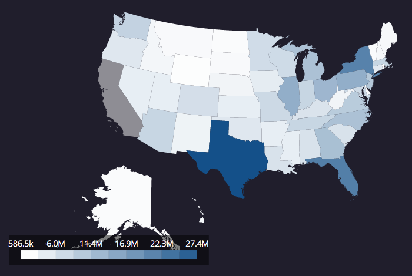 | 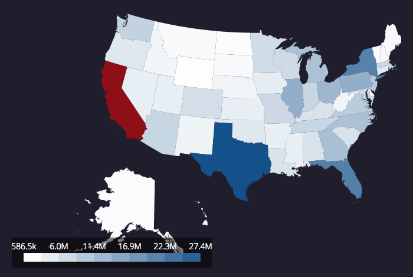 | 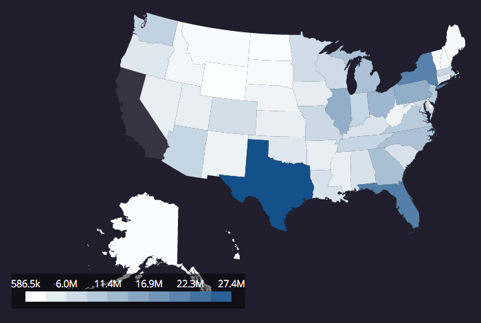

#### Scale
Users can control the scale of the Map coloring, linear or logarithmic.

- `scale` defaults to `"lin"` for linear scale, can be `"log"` for logarithmic scale:

```javascript
render() {
  return(
    <Map data={populations} paths={USA} scale="log" colorRangeLow="#ffffff" colorRangeHigh="#225588" />
  )
}
```

 Default (scale="lin")     | scale="log"     
:-------------------------:|:-------------------------:
 | 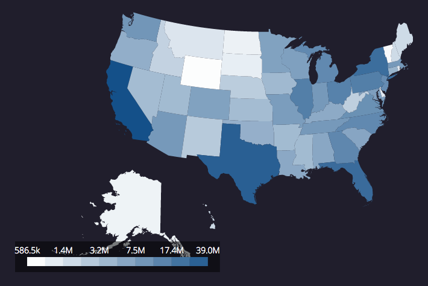

### Tooltip
Tooltips can display more specific information about a data series.

```javascript
render() {
  return(
    <Map data={populations} paths={USA} tooltip={true} tooltipColor="light" />
  )
}
```

- `tooltip` defaults to `true`, `false` turns the tooltip off
- `tooltipColor` defaults to `light`, it can be set to `light` or `dark`
- `tooltipContents` defaults to data associated with the location (title, weight)

Default (tooltipColor="light")|tooltipColor="dark"|tooltip={false}   
:-------------------------:|:-------------------------:|:-------------------------:
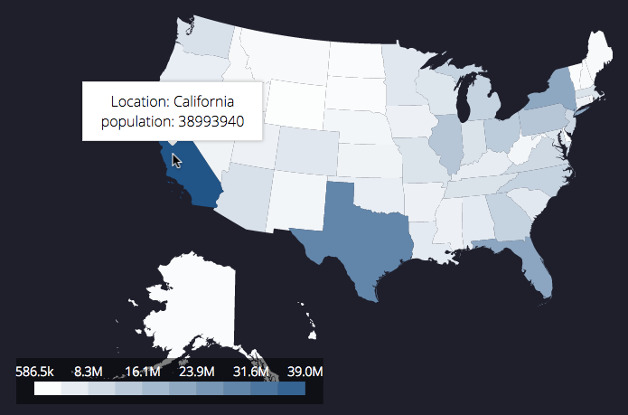 | 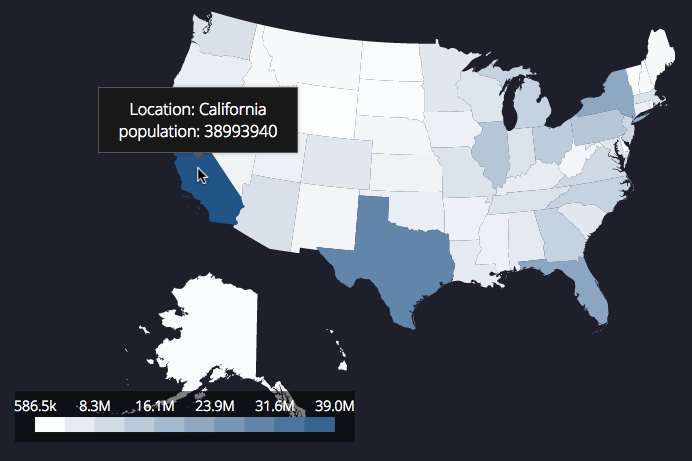 | 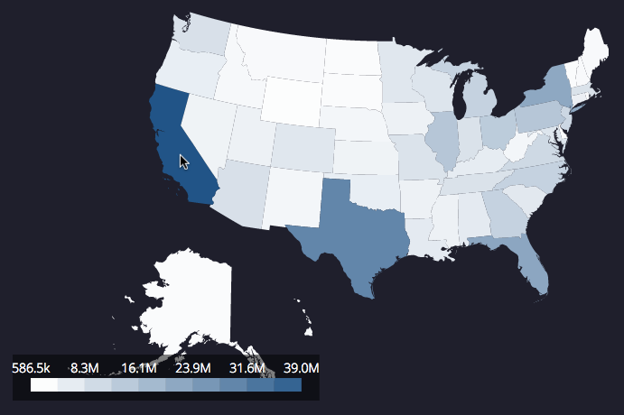

#### User-provided Tooltip Function
Users can customize what is displayed inside the tooltip with a function. Expected arguments to the function are the title of the location and the data for the specific location hovered over. The function should return JSX.

```javascript
fillTooltip(title, data){
  return(
    <div>
      <span>The name of this location is {title}.</span><br/>
      <span>The data for this location looks like: {JSON.stringify(data)}</span>
    </div>
  )
}

render() {
  return(
    <Map data={populations} paths={USA} tooltipContents={this.fillTooltip} />
  )
}
```

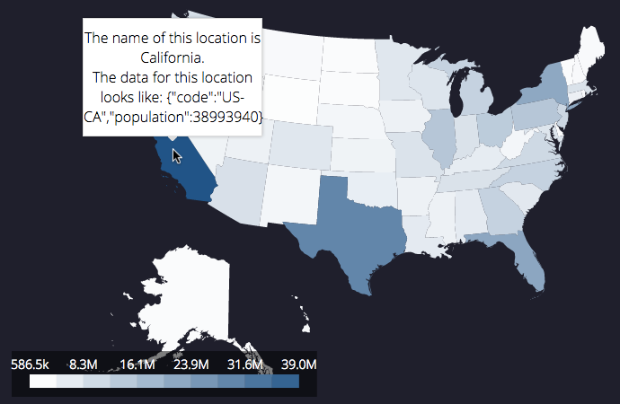

## Supported Countries and Regions

- AFGHANISTAN
- ALBANIA
- ALGERIA
- AMERICAN_SAMOA
- ANDORRA
- ANGOLA
- ANGUILLA
- ANTIGUA_BARBUDA
- ARGENTINA
- ARMENIA
- ARUBA
- AUSTRALIA
- AUSTRIA
- AZERBAIJAN
- BAHAMAS
- BAHRAIN
- BANGLADESH
- BARBADOS
- BELARUS
- BELGIUM
- BELIZE
- BENIN
- BERMUDA
- BHUTAN
- BOLIVIA
- BOSNIA_HERZEGOVINA
- BOTSWANA
- BRAZIL
- BRITISH_VIRGIN_ISLANDS
- BRUNEI_DARUSSALAM
- BULGARIA
- BURKINA_FASO
- BURUNDI
- CAMBODIA
- CAMEROON
- CANADA
- CAPE_VERDE
- CARIBBEAN_NETHERLANDS
- CAYMAN_ISLANDS
- CENTRAL_AFRICAN_REPUBLIC
- CHAD
- CHANNEL_ISLANDS
- CHILE
- CHINA
- CHRISTMAS_ISLAND
- COCOS_ISLANDS
- COLOMBIA
- COMOROS
- CONGO_DR
- CONGO
- COOK_ISLANDS
- COSTA_RICA
- CROATIA
- CUBA
- CURACAO
- CYPRUS
- CZECH_REPUBLIC
- DENMARK
- DJIBOUTI
- DOMINICA
- DOMINICAN_REPUBLIC
- EAST_TIMOR
- ECUADOR
- EGYPT
- EL_SALVADOR
- EQUATORIAL_GUINEA
- ERITREA
- ESTONIA
- ETHIOPIA
- FALKLAND_ISLANDS
- FAROE_ISLANDS
- FIJI_EAST
- FIJI_WEST
- FINLAND
- FRANCE
- FRENCH_GUIANA
- FRENCH_POLYNESIA
- GABON
- GAMBIA
- GEORGIA
- GERMANY
- GHANA
- GIBRALTAR
- GREECE
- GREENLAND
- GRENADA
- GUADELOUPE
- GUAM
- GUATEMALA
- GUINEA_BISSAU
- GUINEA
- GUYANA
- HAITI
- HONDURAS
- HONG_KONG
- HUNGARY
- ICELAND
- INDIA
- INDONESIA
- IRAN
- IRAQ
- IRELAND
- ISLE_OF_MAN
- ISRAEL
- ITALY
- IVORY_COAST
- JAMAICA
- JAPAN
- JERSEY
- JORDAN
- KAZAKHSTAN
- KENYA
- KIRIBATI
- KOSOVO
- KUWAIT
- KYRGYZSTAN
- LAOS
- LATVIA
- LEBANON
- LESOTHO
- LIBERIA
- LIBYA
- LIECHTENSTEIN
- LITHUANIA
- LUXEMBOURG
- MACAO
- MACEDONIA
- MADAGASCAR
- MALAWI
- MALAYSIA
- MALDIVES
- MALI
- MALTA
- MARSHALL_ISLANDS
- MARTINIQUE
- MAURITANIA
- MAURITIUS
- MAYOTTE
- MEXICO
- MICRONESIA
- MOLDOVA
- MONACO
- MONGOLIA
- MONTENEGRO
- MONTSERRAT
- MOROCCO
- MOZAMBIQUE
- MYANMAR
- NAMIBIA
- NAURU
- NEPAL
- NETHERLANDS
- NEW_CALEDONIA
- NEW_ZEALAND
- NICARAGUA
- NIGER
- NIGERIA
- NIUE
- NORTHERN_MARIANA_ISLANDS
- NORTH_KOREA
- NORWAY
- OMAN
- PAKISTAN
- PALAU
- PALESTINE
- PANAMA
- PAPUA_NEW_GUINEA
- PARAGUAY
- PERU
- PHILIPPINES
- PITCAIRN_ISLANDS
- POLAND
- PORTUGAL
- PUERTO_RICO
- QATAR
- REUNION
- ROMANIA
- RUSSIA
- RWANDA
- SAINT_MARTIN
- SAINT_PIERRE_MIQUELON
- SAMOA
- SAN_MARINO
- SAO_TOME_PRINCIPE
- SAUDI_ARABIA
- SENEGAL
- SERBIA
- SEYCHELLES
- SIERRA_LEONE
- SINGAPORE
- SINT_MAARTEN
- SLOVAKIA
- SLOVENIA
- SOLOMON_ISLANDS
- SOMALIA
- SOUTH_AFRICA
- SOUTH_KOREA
- SOUTH_SUDAN
- SPAIN
- SRI_LANKA
- ST_HELENA
- ST_KITTS_NEVIS
- ST_LUCIA
- ST_VINCENT
- SUDAN
- SURINAME
- SVALBARD_JAN_MAYEN
- SWAZILAND
- SWEDEN
- SWITZERLAND
- SYRIA
- TAIWAN
- TAJIKISTAN
- TANZANIA
- THAILAND
- TIBET
- TOGO
- TOKELAU
- TONGA
- TRINIDAD_AND_TOBAGO
- TUNISIA
- TURKEY
- TURKMENISTAN
- TURKS_CAICOS_ISLANDS
- TUVALU
- UGANDA
- UKRAINE
- UNITED_ARAB_EMIRATES
- UNITED_KINGDOM
- URUGUAY
- USA
- US_VIRGIN_ISLANDS
- UZBEKISTAN
- VANUATU
- VENEZUELA
- VIETNAM
- WALLIS_FUTUNA
- WORLD
- YEMEN
- ZAMBIA
- ZIMBABWE
